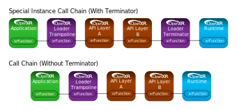
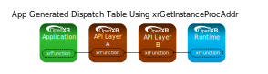

// Copyright (c) 2017-2025 The Khronos Group Inc.
//
// SPDX-License-Identifier: CC-BY-4.0

[[application-interaction]]
== Application Interaction

An application requests a specific version of the OpenXR API when creating
an instance by writing to the "apiVersion" member of the `XrApplicationInfo`
structure which, in turn, is passed into the `XrInstanceCreateInfo`
structure.
If either the loader or the active runtime do not support the requested
version, they may return an error and fail instance creation.
Refer to the link:{uri-openxr-ratified-spec}[OpenXR API Specification]
documentation on `xrCreateInstance` for more information about this.

[[interfacing-with-openxr-functions]]
=== Interfacing with OpenXR Functions
There are two ways an application can choose interface with OpenXR functions
through the loader:

1. Directly linking to the core OpenXR commands exposed and exported by the
   loader.
2. Creating an application-managed dispatch table of OpenXR commands by
querying the loader for function pointers via `xrGetInstanceProcAddr`.
This method supports core OpenXR commands, commands of (enabled) OpenXR
extensions supported by the runtime, and any commands exposed by enabled API
layers.

[[openxr-direct-exports]]
==== OpenXR Direct Exports

The loader library on Windows and Linux will directly export all core OpenXR
commands for the OpenXR version it supports.
When an application links directly to the loader library in this way, the
OpenXR calls are simple _trampoline_ functions that jump to the appropriate
dispatch table entry for the object provided.

The specific list, in alphabetical order, of OpenXR commands directly
exported by the loader for API version 1.0 are:

- `xrAcquireSwapchainImage`
- `xrApplyHapticFeedback`
- `xrAttachSessionActionSets`
- `xrBeginFrame`
- `xrBeginSession`
- `xrCreateAction`
- `xrCreateActionSet`
- `xrCreateActionSpace`
- `xrCreateInstance`
- `xrCreateReferenceSpace`
- `xrCreateSession`
- `xrCreateSwapchain`
- `xrDestroyAction`
- `xrDestroyActionSet`
- `xrDestroyInstance`
- `xrDestroySession`
- `xrDestroySpace`
- `xrDestroySwapchain`
- `xrEndFrame`
- `xrEndSession`
- `xrEnumerateApiLayerProperties`
- `xrEnumerateBoundSourcesForAction`
- `xrEnumerateEnvironmentBlendModes`
- `xrEnumerateInstanceExtensionProperties`
- `xrEnumerateReferenceSpaces`
- `xrEnumerateSwapchainFormats`
- `xrEnumerateSwapchainImages`
- `xrEnumerateViewConfigurations`
- `xrEnumerateViewConfigurationViews`
- `xrGetActionStateBoolean`
- `xrGetActionStateFloat`
- `xrGetActionStatePose`
- `xrGetActionStateVector2f`
- `xrGetCurrentInteractionProfile`
- `xrGetInputSourceLocalizedName`
- `xrGetInstanceProcAddr`
- `xrGetInstanceProperties`
- `xrGetReferenceSpaceBoundsRect`
- `xrGetSystem`
- `xrGetSystemProperties`
- `xrGetViewConfigurationProperties`
- `xrLocateSpace`
- `xrLocateViews`
- `xrPathToString`
- `xrPollEvent`
- `xrReleaseSwapchainImage`
- `xrRequestExitSession`
- `xrResultToString`
- `xrStopHapticFeedback`
- `xrStringToPath`
- `xrStructureTypeToString`
- `xrSuggestInteractionProfileBindings`
- `xrSyncActions`
- `xrWaitFrame`
- `xrWaitSwapchainImage`

When an OpenXR application chooses to use one of the exports directly
exposed from the OpenXR loader, the call chain will look like one of the
following (if the user has enabled two API layers):

The "Special Instance" call chain is used in several places where the loader
has to perform some work before and after any API layers, but prior to
calling the enabled runtime.
`xrCreateInstance`, `xrDestroyInstance`, and `xrGetInstanceProcAddr` are
three of the main commands that fall into this group.
Most commands do not require a terminator and will use the second call
chain.

[[openxr-indirect-linking]]
==== OpenXR Indirect Linking

With loader indirect linking an application dynamically generates its own
dispatch table of OpenXR commands.
This method allows an application to fail gracefully if the loader cannot be
found, or supports an older version of the API than the application.
To do this, the application uses the appropriate platform specific dynamic
symbol lookup (such as dlsym()) on the loader library to discover the
address of the `xrGetInstanceProcAddr` command.
Once discovered, this command can be used to query the addresses of all
other OpenXR commands (such as `xrCreateInstance`,
`xrEnumerateInstanceExtensionProperties` and
`xrEnumerateApiLayerProperties`).
Then, the application would use its table of function pointers to make the
call into the OpenXR API.

One benefit when an application generates its own dispatch table is the
removal of the loader trampoline call from most commands in a call chain,
which could potentially increase performance.
In that case, most commands would use the following call chain:

[[openxr-loader-library-name]]
==== OpenXR Loader Library Name

The OpenXR loader's dynamic library name is dependent on the user's
underlying operating system.
The following table shows the loader library names for common OSs:

[width="50%",options="header",cols="^.^40%,^.^60%"]
|====
| Operating System   | Loader Library Name
| Windows
    | openxr-loader.lib/.dll
| Linux
    | libopenxr_loader.so.<major>
|====

<major> and <minor> in the above table refer to the major and minor API
versions of OpenXR.

[[application-api-layer-usage]]
=== Application API Layer Usage

Applications desiring OpenXR functionality beyond what the core API offers
may use various API layers or extensions.
An API layer cannot introduce new OpenXR _core_ API commands, but may
introduce new extension-specific OpenXR commands that can be queried through
the extension interface.

A common use of API layers is for validation which can be enabled by loading
the API layer during application development, but not loading the API layer
for application release.
The overhead cost of validation is completely eliminated when the layer is
not loaded.

An application can discover which API layers are available to it with
`xrEnumerateApiLayerProperties`.
This will report all API layers that have been discovered by the loader.
The loader looks in various locations to find API layers on the system.
For more information see the <<api-layer-discovery,API Layer discovery>>
section below.

An API layer or layers may be enabled by an application by passing a list of
names in the `enabledApiLayerNames` field of the `XrInstanceCreateInfo` at
`xrCreateInstance` time.
During the `xrCreateInstance`, the loader constructs a <<openxr-call-chains,
call chain>> that includes the application specified (enabled) API layers.

Order is important in the `enabledApiLayerNames` array; array element 0 is
the topmost (closest to the application) API layer inserted in the chain and
the last array element is closest to the runtime.
See the <<overall-api-layer-ordering, Overall API Layer Ordering>> section
for more information on API layer ordering.

[NOTE]
.Important
====
Some API layers interact with other API layers in order to perform their
tasks.
Consult the appropriate API layer documentation when enabling an API layer
to ensure that you are using it properly.
====

[[implicit-vs-explicit-api-layers]]
==== Implicit vs Explicit API Layers

Explicit API layers are API layers which are enabled by an application (e.g.
with the `xrCreateInstance` function) or by setting a
<<forced-loading-of-api-layers, loader environment variable>>.

Implicit API layers are API layers which are enabled simply because they
exist.
An implicit layer found by the loader will be loaded by default, unless
specifically disabled.

Some implicit API layer examples include:

* A performance monitoring API layer which is enabled while using an
  external tool.
* An application environment API layer (e.g. Steam or a game console) that
  enables additional features/tools for applications.
* A tracing API layer designed to record API commands for future playback.

Because implicit API layers are enabled automatically, they have an
additional requirement over explicit API layers in that they must specify a
"disable environment variable" in the API layer's
<<api-layer-manifest-file-format, JSON manifest file>>, with key name
`disable_environment`.
This environment variable when present will disable the implicit API layer.
Implicit API layers are not otherwise visible to or controllable by
applications.

Optionally, an implicit API layers may specify an "enable environment
variable", in which case the loader will load the implicit API layer only
when the enable environment variable is defined in the user's execution
environment.
If both enable and disable environment variables are present in the
environment, the layer will be disabled.

Both the enable and disable environment variables are specified in the API
layer's JSON manifest file, which is created by the API layer developer.

Discovery of system-installed implicit and explicit API layers is described
later in the <<api-layer-discovery, API Layer Discovery Section>>.
For now, simply know that what distinguishes an API layer as implicit or
explicit is dependent on the operating system, as shown in the table below.

.OS Implicit API Layer Detection Method

[options="header",cols="^.^30%,<.^70%"]
|====
| Operating System   | Implicit API Layer Identification Method
| Windows
    | Implicit API Layers are located in the
    <<windows-manifest-registry-usage, Windows Registry>> under the "ApiLayers\Implicit"
    key.
| Linux
    | Implicit API Layers are located in the "api_layers/implicit.d" folder under any of the
    <<linux-manifest-search-paths, common API layer paths>>.
|====

[[forcing-api-layer-folders]]
==== Forcing API Layer Folders (Desktop Only)

Desktop developers may also override the way the loader searches for API
layers.
If the developer/user would like to find API layers in a non-standard
location, they may define the "XR_API_LAYER_PATH" environmental variable.
For more information on using "XR_API_LAYER_PATH", see the
<<overriding-the-default-api-layer-paths, Overriding the Default API Layer
Paths>> section under "API Layer Interaction".

[[forced-loading-of-api-layers]]
==== Forced Loading of API Layers (Desktop Only)

Desktop developers may want to enable API layers that are not enabled by the
given application they are using.
On Linux and Windows, the environment variable "XR_ENABLE_API_LAYERS" can be
used to enable additional API layers which are not specified (enabled) by
the application at `xrCreateInstance`.
"XR_ENABLE_API_LAYERS" is a colon (Linux)/semi-colon (Windows) separated
list of API layer names to enable.
Order is relevant with the first API layer in the list being the top-most
API layer (closest to the application) and the last API layer in the list
being the bottom-most API layer (closest to the driver).
See the <<overall-api-layer-ordering, Overall API Layer Ordering>> section
for more information.

Application specified API layers and user specified API layers (via
environment variables) are aggregated and duplicates removed by the loader
when enabling API layers.
API layers specified via environment variable are top-most (closest to the
application) while API layers specified by the application are bottom-most.
If an API layer name appears multiple times in the list of API layers to
enable, all occurrences after the first are ignored.

To use `XR_ENABLE_API_LAYERS`, simply define the environment variable with a
properly delimited list of API layer names.
This is not the file name, but the name the API layers use when normally
being enabled inside of `xrCreateInstance`.
This usually takes the form of:

* An OpenXR API layer prefix string: "XR_APILAYER_"
* The name of the vendor developing the API layer: e.g. "LUNARG_"
* A short descriptive name of the API layer: e.g. "test"

This would produce the name of: XR_APILAYER_LUNARG_test

[example]
.Setting XR_ENABLE_API_LAYERS
====
*Windows*

----
set XR_ENABLE_API_LAYERS=XR_APILAYER_LUNARG_test1;XR_APILAYER_LUNARG_test2
----

*Linux*

----
export XR_ENABLE_API_LAYERS=XR_APILAYER_LUNARG_test1:XR_APILAYER_LUNARG_test2
----
====

[[overall-api-layer-ordering]]
==== Overall API Layer Ordering

The overall ordering of all API layers by the loader based on the above
looks as follows:

As shown in the above image, any implicit API layers will first intercept
OpenXR commands, followed by any explicit API layers enabled by
environmental variables, finally being intercepted by any explicit API
layers directly enabled by the application.
Whether or not the API layers continue into a loader _terminator_ call, or
directly into a runtime depends on the <<openxr-call-chains, call chain>>.

Ordering may also be important internal to the list of explicit API layers.
Some API layers may be dependent on other behavior being implemented before
or after the loader calls it.

[[application-usage-of-extensions]]
=== Application Usage of Extensions

Extensions are optional functionality provided by the loader, an API layer,
or a runtime.
Extensions can modify the behavior of the OpenXR API and need to be
specified and registered with Khronos.
These extensions can be created by a runtime vendor to expose new runtime
and/or XR hardware functionality, or by an API layer writer to expose some
internal feature, or by the loader to add additional loader functionality.
Information about various extensions can be found in the
link:{uri-openxr-ratified-spec}[OpenXR API Specification], and `openxr.h`
header file.

To use extension functionality, the application should: call
`xrEnumerateInstanceExtensionProperties` to determine if the extension is
available.
Then it must: enable the extension in `xrCreateInstance`.

If an application fails to determine whether an extension is available, and
calls `xrCreateInstance` with that extension name in the list, the
`xrCreateInstance` call will fail if it's not supported.

When calling `xrEnumerateInstanceExtensionProperties` with NULL passed in
for "layerName", the loader discovers and aggregates all extensions from
implicit API layers (if allowable by OS), runtimes, and itself before
reporting them to the application.
If "layerName" is not NULL, and "layerName" is equal to a discovered API
layer module name (which may belong to either an implicit or explicit API
layer) then only extensions from that API layer are enumerated.

Duplicate extensions (e.g. an implicit API layer and runtime might report
support for the same extension) are eliminated by the loader.
For duplicates, the API layer version is reported and the runtime version is
culled according to the loader ordering - an extension name is removed from
the extension request list after loading the layer.

If an application fails to enable the extension using the
"enabledExtensionNames" field in the `XrInstanceCreateInfo` structure passed
into `xrCreateInstance` and then attempts to use that extension, it may:
result in undefined behavior.
For example, querying an extension command using `xrGetInstanceProcAddr`
might appear to succeed without having the extension enabled, only to then
crash when calling that command.

