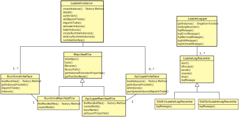

[[loader-design]]
== Loader Design ==

This section of the document is focused on the internal design of
the OpenXR loader provided in the `src/loader` folder.

The OpenXR loader is composed of several classes.  The overall class
diagram looks roughly like the following:

[[class-roles]]
=== Class Roles ===

==== Manifest File Classes ====

The Desktop OpenXR loader uses JSON manifest files for information about
available <<api-layer-manifest-file-format, API layers>> and
<<runtime-manifest-file-format, runtimes>>.  All the functionality for finding,
parsing, and processing the various manifest file formats are found in the
three manifest file classes: `ManifestFile`, `RuntimeManifestFile`, and
`ApiLayerManifestFile`.  All three classes are defined in the `manifest_file`
header (.hpp) and source (.cpp) files.

[[manifestfile]]
.ManifestFile

`ManifestFile` is the base class containing the majority of common code.
It only performs a minimal set of validation and provides accessor functions.
These functions perform all the work using two primary sources:

* The std::experimental::filesystem pass:[C++] functionality exposed by most
  modern compilers for finding the manifest files.
* The https://github.com/open-source-parsers/jsoncpp[JsonCPP] library for
  processing and validating the manifest files once located.

[[runtimemanifestfile]]
.RuntimeManifestFile

`RuntimeManifestFile` is a derived class (with <<manifestfile,ManifestFile>>
as the parent) which handles specifically finding and parsing any
<<runtime-manifest-file-format, runtime manifest files>>.  It implements a
static function fname:FindManifestFiles which is to be used as a factory method
for finding all available runtime manifest files, creating an instance of
`RuntimeManifestFiles` for each, and saving them if they appear to be valid.
This is the command that any OpenXR command inside the loader should
call if it requires a list of available runtime manifest files.

[source,c++]
----
static XrResult RuntimeManifestFile::FindManifestFiles(
            ManifestFileType type,
            std::vector<std::unique_ptr<RuntimeManifestFile>> &manifest_files);
----
  * pname:type indicates the specific type of manifest file being searched for.
    In this case, it must: be `MANIFEST_TYPE_RUNTIME`.
  * pname:manifest_files is a vector that will be used to store a unique_ptr to
    each valid runtime manifest file found.

The `RuntimeManifestFile` also provides a utility function for creating an
instance of itself if it determines everything is valid inside the JSON file.
fname:CreateIfValid not only validates the JSON format, but also verifies that
the specific fields required by the RuntimeManifestFile class are available.

[source,c++]
----
void RuntimeManifestFile::CreateIfValid(
            std::string filename,
            std::vector<std::unique_ptr<RuntimeManifestFile>> &manifest_files);
----
  * pname:filename indicates the absolute file name path to the manifest file
    that needs to be loaded and verified.
  * pname:manifest_files is a vector that will be used to store a unique_ptr to
    each valid runtime manifest file found.  If this call determines the file
    exists and is valid, it will create an instance of `RuntimeManifestFile`
    and add it to this vector.

[[apilayermanifestfile]]
.ApiLayerManifestFile

Similar to <<runtimemanifestfile,RuntimeManifestFile>>, `ApiLayerManifestFile` is a
derived class (with <<manifestfile,ManifestFile>> as the parent).  This class
handles specifically finding and parsing any
<<api-layer-manifest-file-format, API layer manifest files>>.  It also implements a
static function fname:FindManifestFiles which is to be used as a factory method
for finding all available API layer manifest files, creating an instance of
`ApiLayerManifestFiles` for each, and saving them if they appear to be valid.
This is the command that any OpenXR command inside the loader should
call if it requires a list of available API layer manifest files.

[source,c++]
----
static XrResult ApiLayerManifestFile::FindManifestFiles(
            ManifestFileType type,
            std::vector<std::unique_ptr<ApiLayerManifestFile>> &manifest_files);
----
  * pname:type indicates the specific type of manifest file being searched for.
    In this case, it must: be either `MANIFEST_TYPE_IMPLICIT_API_LAYER` or
    `MANIFEST_TYPE_EXPLICIT_API_LAYER`.
  * pname:manifest_files is a vector that will be used to store a unique_ptr to
    each valid API layer manifest file found.

The `ApiLayerManifestFile` also provides a utility function for creating an
instance of itself if it determines everything is valid inside the JSON file.
fname:CreateIfValid not only validates the JSON format, but also verifies that
the specific fields required by the ApiLayerManifestFile class are available.

[source,c++]
----
void ApiLayerManifestFile::CreateIfValid(
            std::string filename,
            std::vector<std::unique_ptr<ApiLayerManifestFile>> &manifest_files);
----
  * pname:filename indicates the absolute file name path to the manifest file
    that needs to be loaded and verified.
  * pname:manifest_files is a vector that will be used to store a unique_ptr to
    each valid runtime manifest file found.  If this call determines the file
    exists and is valid, it will create an instance of `ApiLayerManifestFile`
    and add it to this vector.

==== Library Interface Classes ====

The OpenXR loader is responsible with interfacing with other libraries to
complete its tasks.  Typically, there will be some interface negotiation
between these other libraries and the loader (see
<<loader-api-layer-interface-negotiation, Loader/Layer Interface Negotiation>>
or 
<<loader-runtime-interface-negotiation, Loader/Runtime Interface Negotiation>>
for more information).   The Interface classes are responsible with using
the contents of a ManifestFile to setup the interface.  Each Interface
class must be used with the appropriate ManifestFile type to properly interface
with a specific type of library.

[[runtimeinterface]]
.RuntimeInterface

The `RuntimeInterface` is tasked with working with runtime libraries.  Once
the runtime manifest file information is found and parsed by the
<<runtimemanifestfile, RuntimeManifestFile>> class, it is passed along to
this class which will load the appropriate library and perform the required
<<loader-runtime-interface-negotiation, Loader/Runtime Interface Negotiation>>.

The `RuntimeInterface` implements a static function fname:LoadRuntime which
is to be used as a factory method for loading the current active runtime,
performing the appropriate negotiation, and then creating an instance of
`RuntimeInterface`.
This is the command that any OpenXR command inside the loader should call if
it requires loading the runtime.
The command will only truly load the runtime library if it is not currently
loaded, and then keep a reference count of how many requests to load it have
been made.

[source,c++]
----
static XrResult RuntimeInterface::LoadRuntime();
----

Likewise, the `RuntimeInterface` implements a static function
fname:UnloadRuntime which is to be used to unload the current active runtime.
This will reduce the reference count until it is 0 and then unload the
active runtime library.

[source,c++]
----
static XrResult RuntimeInterface::UnloadRuntime();
----

Finally, the `RuntimeInterface` implements a static function
fname:GetRuntime which is used to return the single instance of the
`RuntimeInterface` class.

[source,c++]
----
static RuntimeInterface& GetRuntime();
----

During `XrInstance` creation and destruction, the `RuntimeInterface` needs
to work directly with the runtime library.  To do this, the `RuntimeInterface`
has two methods that are used by the OpenXR loader:

[source,c++]
----
XrResult RuntimeInterface::CreateInstance(
        const XrInstanceCreateInfo* info);
----
  * pname:info is a pointer to the `XrInstanceCreateInfo` passed into the
    OpenXR `xrCreateInstance` command that triggered this call.

Once successful completion occurs, the `RuntimeInterface` will:

* Store the runtime's version of the `XrInstance`
* Generate a dispatch table to all known OpenXR commands implemented by
  the runtime.

To destroy a runtime's instance as part of the `xrDestroyInstance`
command, the loader calls fname:DestroyInstance;

[source,c++]
----
XrResult RuntimeInterface::DestroyInstance();
----

[[apilayerinterface]]
.ApiLayerInterface

Similarly, the `ApiLayerInterface` class is tasked with working with API layer
libraries.  Once the API layer manifest file information is found and parsed by the
<<apilayermanifestfile, ApiLayerManifestFile>> class, it is passed along to
this class which will load the appropriate library and perform the required
<<loader-api-layer-interface-negotiation, Loader/Layer Interface Negotiation>>.

The `ApiLayerInterface` implements a static function fname:LoadApiLayers which
is to be used as a factory method for loading all available API layers,
performing the appropriate negotiation, and then creating an instance of
`ApiLayerInterface` for each. This is the command that any OpenXR command inside
the loader should call if it requires load one or more API layers:

[source,c++]
----
static XrResult ApiLayerInterface::LoadApiLayers(
        std::vector<std::unique_ptr<ApiLayerManifestFile>>& manifest_files,
        std::vector<std::string> enabled_layers,
        std::vector<std::unique_ptr<ApiLayerInterface>>& api_layer_interfaces);
----
  * pname:manifest_files is a vector of unique_ptr elements containing the
    loaded API layer manifest information.  The contents of this vector will be
    either transferred to a new `ApiLayerInterface` object placed in the
    pname:api_layer_interfaces vector, or deleted when the call to this method
    completes.
  * pname:enabled_layers is a vector of names for all API layers that are enabled
    by the environment or the user.
  * pname:api_layer_interfaces is a vector that will be used to store a
    unique_ptr to a `ApiLayerInterface` object representing each valid API layer that
    is enabled and has completed loading and negotiation.

==== The LoaderInstance Class ====

The primary OpenXR object is the `XrInstance`, and from that most other data
is either queried or created.  In many ways, the `XrInstance` object is a
loader object that manages all the other underlying OpenXR objects/handles.
Because of this, a large amount of data needs to be associated with it by
the loader.
In order to do this, the loader maps an internal `LoaderInstance` object
pointer to the returned `XrInstance` value.

A `LoaderInstance` is created during the OpenXR `xrCreateInstance` call, and
destroyed during the `xrDestroyInstance` call.
During `xrCreateInstance` the loader code calls
`LoaderInstance`::pname:CreateInstance factory method:

[[CreateInstance]]
[source,c++]
----
static XrResult LoaderInstance::CreateInstance(
        std::vector<std::unique_ptr<ApiLayerInterface>>& api_layer_interfaces,
        const XrInstanceCreateInfo* info,
        XrInstance* instance);
----
  * pname:api_layer_interfaces is a vector that contains a unique_ptr to all
    `ApiLayerInterface` objects that are valid and enabled.  All of these
    pointers will be moved to the `LoaderInstance` on successful completion
    of the `CreateInstance` call.
  * pname:info is a pointer to the `XrInstanceCreateInfo` passed into the
    OpenXR `xrCreateInstance` command that triggered this call.
  * pname:instance contains a returned pointer to the `XrInstance` that
    will be returned upon successful execution and associated with this
    `LoaderInstance` object.

During the fname:CreateInstance call, the loader will perform the following
work:

* Generate the call chain for both `xrCreateInstance` and
  `xrGetInstanceProcAddr` that passes through all enabled API layers and the
  runtime.
* Create the instance using the generated `xrCreateInstance` call chain.
* Create a parallel `LoaderInstance*` associated with the returned
  `XrInstance` using a C++ "unordered_map"
* Generate a top-level dispatch table containing all the supported commands.
** This table is built by using the generated `xrGetInstanceProcAddr`
   call chain

Because the loader knows what runtime need to be called as part of the
create sequence, it inserts a terminator during the `xrCreateInstance`
sequence called `loaderXrTermCreateInstance` after the last API layer in order
to create the runtime instance.

==== Logging Classes ====

.LoaderLogger

The `LoaderLogger` class was created to provide global logging capability
to the OpenXR loader.  It was implemented as a Singleton to reduce the
overhead of passing pointers/references around to the various loader
objects.

To get a reference to the `LoaderLogger` singleton, use the fname:GetInstance
method:

[source,c++]
----
static LoaderLogger& LoaderLogger::GetInstance();
----

The `LoaderLogger` works by sending all received messages to various
instances of <<loaderlogrecorder, LoaderLogRecorder> objects.  To add a
`LoaderLogRecorder` to the `LoaderLogger`, call fname:AddLogRecorder:

[source,c++]
----
void LoaderLogger::AddLogRecorder(
        std::unique_ptr<LoaderLogRecorder>& recorder);
----
  * pname:recorder is a unique_ptr to a create `LoaderLogRecorder` or
    derived object.

Once added, general log messages will be passed to each of the
`LoaderLogRecorder` stored in an internal vector.  Any source inside
of the loader may trigger a log message by using the pname:LogMessage
command:

[source,c++]
----
bool LoaderLogger::LogMessage(
        XrLoaderLogMessageSeverityFlagBits message_severity,
        XrLoaderLogMessageTypeFlags message_type,
        const std::string& message_id,
        const std::string& command_name
        const std::string& message,
        const std::vector<XrLoaderLogObjectInfo>& objects = {});
----
  * pname:message_severity the severity of the message
  * pname:message_type is type of the message
  * pname:message_id is the message id, typically for loader messages this
    is "OpenXR-Loader"
  * pname:command_name is the name of the OpenXR command associated with
    the message.  May be an empty string.
  * pname:message is the message.
  * pname:objects a vector of objects that are relevant to this message.
    May be empty.

Because of the complex nature of that method, and the fact that most log
messages can be simplified, the OpenXR loader also supplies the following
static methods for logging:

[source,c++]
----
static bool LogErrorMessage(
        const std::string& command_name,
        const std::string& message,
        const std::vector<XrLoaderLogObjectInfo>& objects = {});
static bool LogWarningMessage(
        const std::string& command_name,
        const std::string& message,
        const std::vector<XrLoaderLogObjectInfo>& objects = {});
static bool LogInfoMessage(
        const std::string& command_name,
        const std::string& message,
        const std::vector<XrLoaderLogObjectInfo>& objects = {});
static bool LogVerboseMessage(
        const std::string& command_name,
        const std::string& message,
        const std::vector<XrLoaderLogObjectInfo>& objects = {});
----
  * pname:command_name the OpenXR command that is related to the message.
    May be an empty string.
  * pname:message the message that needs to be logged
  * pname:objects an optional array of OpenXR object handles that are related
    to the log message.

It's important to note that these static methods also take care of grabbing
the `LoaderLogger`::fname:GetInstance() and making the appropriate call
to `LoaderLogger`::pname:LogMessage().

[example]
.Using the Log Messages
====
Here are a few examples of triggering a log message:

[source,c++]
----
XrResult res = xrCreateInstance(info, instance);
if (XR_SUCCESS != res) {
    std::string error_message = "xrCreateInstance failed with result ";
    error_message += std::to_string(res);
    LoaderLogger::LogErrorMessage("", error_message);
}
----

[source,c++]
----
// After successfully adding all API layers
LoaderLogger::LogInfoMessage("", "Loaded all API layers");
----

In these examples, the message does not correspond to a named command so an empty string is passed.
====

[[loaderlogrecorder]]
.LoaderLogRecorder

The `LoaderLogRecorder` is a base class that defines the basics used for
recording a log message somewhere.  `LoaderLogRecorder` provides no protections
for multithreading logging.  Any required protections should be implemented
by the derived class that is multithread sensitive (i.e. if a logger wrote to a
file).

The pure virtual method the base class defines that is used to record log
messages is the fname:LogMessage method.  Each derived class is responsible for
defining exactly how log messages are recorded.

[source,c++]
----
virtual bool LogMessage(
        XrLoaderLogMessageSeverityFlagBits message_severity,
        XrLoaderLogMessageTypeFlags message_type,
        const XrLoaderLogMessengerCallbackData* callback_data) = 0;
----

Some utility methods that the `LoaderLogRecorder` base class supplies allow
controls over whether or not log messages are actually recorded.  Upon creation,
a `LoaderLogRecorder` is set to actively record all messages that contain
the appropriate flags.  However, if we want to pause recording to one or more
of the `LoaderLogRecorders` at some point and then resume recording again
later, the following utilities can be used:

[source,c++]
----
virtual void Pause();
virtual void Resume();
bool IsPaused();
----

.LoaderLogRecorder Derived classes

Currently, there are two private classes derived from `LoaderLogRecorder`,
providing three basic behaviors:

* `OstreamLoaderLogRecorder`
** Outputs to `std::cerr` when created with `MakeStdErrLoaderLogRecorder()`
** Outputs to `std::cout` when created with `MakeStdOutLoaderLogRecorder()`
* `DebugUtilsLogRecorder`
** Created by `MakeDebugUtilsLoaderLogRecorder()`

The recorder created by `MakeStdErrLoaderLogRecorder()` handles recording
all error messages that occur in the loader out to `std::cerr`.  This logger
is always enabled and is intended to always provide error messages for easier
issue diagnosis.

The recorder created by `MakeStdOutLoaderLogRecorder()` records messages
out to `std::cout`.  This logger is enabled when the
<<loader-debugging, XR_LOADER_DEBUG>> environment variable is defined.

The recorder created by `MakeDebugUtilsLoaderLogRecorder()` triggers an
`XR_EXT_debug_utils` callback every time a log message occurs.
Two steps are required before the loader enables this class:

 1. The `XR_EXT_debug_utils` must: be enabled during fname:xrCreateInstance call.
 2. The application must: create a `XrDebugUtilsMessengerEXT` by
  * Supplying an sname:XrDebugUtilsMessengerCreateInfoEXT structure to the
    sname:XrInstanceCreateInfo::pname:next chain during fname:xrCreateInstance, or
  * Calling fname:xrCreateDebugUtilsMessengerEXT.

[[automatically-generated-code]]
=== Automatically Generated Code ===

In order to allow the OpenXR loader to be as flexible as possible, we
generate a large portion of the code automatically using the xr.xml registry
file.  The generation process is triggered during the build.  This is done
inside the `CMakelists.txt` files in both the `src` and `src/loader` folders,
using the macro `run_xml_generate_dependency`.  This macro (defined in the
`src/CMakelists.txt` file, triggers python and generates the source.  The
generation scripts are based on the functionality originally defined in the
of the `specification/scripts` folder, but here they've been extended to
generate loader source code.

The loader automatic code generation scripts are found in the `src/scripts`
folder.  The main script of interest for OpenXR loader code generation is
`automatic_source_generation.py` which generates 4 files during the build
process:

.Automatically Generated Loader Files
[width="70%",options="header",cols="50,50"]
|====
| Location | Filename
.2+| <build>/src folder
    l| xr_generated_dispatch_table.h
    l| xr_generated_dispatch_table.c
.2+| <build>/src/loader folder
    l| xr_loader_generated.hpp
    l| xr_loader_generated.cpp
|====

==== xr_generated_dispatch_table.h ====

This C-style header contains the definition of the
sname:XrGeneratedDispatchTable structure.  This structure can be used to store
function pointers for any OpenXR commands defined in the xr.xml at the time
the loader was built.  It includes slots for both core and extension function
pointers.  Currently, the loader uses this structure as well as the provided API Layers.

A partial listing from the generated table follows:

[[XrGeneratedDispatchTable]]
[source,c++]
----
// Generated dispatch table
struct XrGeneratedDispatchTable {

    // ---- Core 1.0 commands
    PFN_xrGetInstanceProcAddr GetInstanceProcAddr;
    PFN_xrEnumerateApiLayerProperties EnumerateApiLayerProperties;
    PFN_xrEnumerateInstanceExtensionProperties EnumerateInstanceExtensionProperties;
    PFN_xrCreateInstance CreateInstance;
    PFN_xrDestroyInstance DestroyInstance;
    ...
};
----

You'll notice that the `xr` prefix was dropped on the name of the elements
within the structure to simplify naming as well as avoid any potential
compilation conflicts.

The `xr_generated_dispatch_table.h` header also includes a utility function that
can be used to populate a dispatch table once it has been created:

[[GeneratedXrPopulateDispatchTable,GeneratedXrPopulateDispatchTable]]
[source,c++]
----
void GeneratedXrPopulateDispatchTable(
        struct XrGeneratedDispatchTable *table,
        XrInstance instance,
        PFN_xrGetInstanceProcAddr get_inst_proc_addr);
----
  * pname:table is a pointer to the slink:XrGeneratedDispatchTable to populate.
  * pname:instance is the instance required by pname:get_inst_proc_addr.
    *NOTE*: This may have a value of `XR_NULL_HANDLE`, but many of the commands
    may be `NULL` if this is used.
  * pname:get_inst_proc_addr is a pointer to the `xrGetInstanceProcAddr` command
    to use to populate the table.  If you're calling into the OpenXR loader,
    this would be the standard `xrGetInstanceProcAddr` call.  However, if you
    were calling this from an API layer, you would want to use the next level's
    (API layer or runtime) implementation of `xrGetInstanceProcAddr`.

==== xr_generated_dispatch_table.c ====

This file is paired with the above `xr_generated_dispatch_table.h` header and
only implements the flink:GeneratedXrPopulateDispatchTable function used to populate
the elements of a dispatch table.

==== xr_loader_generated.hpp ====

`xr_loader_generated.hpp` contains prototypes for all the manually defined
instance command trampoline and terminator functions.  This is done so that
they can be referenced in the `xr_loader_generated.cpp` source file which
is used for `xrGetInstanceProcAddr` as well as setting up the loader
dispatch table.

Also included is a utility function prototype that will initialize a
`LoaderInstance` dispatch table:

[[LoaderGenInitInstanceDispatchTable]]
[source,c++]
----
void LoaderGenInitInstanceDispatchTable(
        XrInstance runtime_instance,
        std::unique_ptr<XrGeneratedDispatchTable>& table);
----
  * pname:runtime_instance is the `XrInstance` returned by the runtime
    on the related call to fname:xrCreateInstance and that should be
    used to initialize pname:table.
  * pname:table is the dispatch table to initialize.

Additionally, this file contains extern prototypes for instances of the
`HandleLoaderMap<>` class template, containing mainly an `unordered_map`
and a `mutex`, that are used for storing the created OpenXR Object handles
and relating them to their parent `XrInstance`.  There should be one
`HandleLoaderMap<>` instance for each OpenXR Object Handle type.  See the
<<functional-flow, Functional Flow>> section for more information about
the usage of these.

This file also contains the prototype of a function that is used to
clean up the OpenXR Object unordered_maps entries related to a
`LoaderInstance` that is being deleted:

[[LoaderCleanUpMapsForInstance]]
[source,c++]
----
void LoaderCleanUpMapsForInstance(
        class LoaderInstance *instance);
----
  * pname:loader_instance is a pointer to the `LoaderInstance`
    that is going away and needs all references removed from all the
    global state.

==== xr_loader_generated.cpp ====

The `xr_loader_generated.cpp` source file contains the implementation
of all generated OpenXR trampoline functions.

For example, it contains the implementations of
flink:LoaderGenInitInstanceDispatchTable and
flink:LoaderCleanUpMapsForInstance.

It also includes a function automatically generated for the `ApiLayerInterface`
class that will update a dispatch table for that class,
`ApiLayerInterface`::fname:GenUpdateInstanceDispatchTable.  The function
calls the API layer's version of `xrGetInstanceProcAddr` to populate the various
entries in a `XrGeneratedDispatchTable`.

[source,c++]
----
void ApiLayerInterface::GenUpdateInstanceDispatchTable(
        XrInstance instance,
        std::unique_ptr<XrGeneratedDispatchTable>& table);
----
  * pname:instance is the instance returned by the next component in the call-chain
    during fname:xrCreateInstance and is used with the next component's
    fname:xrGetInstanceProcAddr call.
  * pname:table is a reference to the table to update with the
    `ApiLayerInterface` 's API layer version of the fname:xrGetInstanceProcAddr.

Because this is an API layer, it will only populate the entry of a dispatch table if
the API layer's `xrGetInstanceProcAddr` returns non-`NULL` for that command.  This is
because the loader calls this command to generate the top-level dispatch table
when setting up the <<openxr-call-chains,call chain>>.  The loader starts
by creating a dispatch table pointing to the runtime commands.  It then
reverse increments through all enabled API layers, calling `ApiLayerInterface`::
fname:GenUpdateInstanceDispatchTable for each API layer, which replaces only
the commands that the specific API layer implements.  This results in a
dispatch table whose elements point to only the first implementation of each
OpenXR command.

[[manually-implemented-code]]
=== Manually Implemented Code ===

Some OpenXR command terminator and trampoline functions need to be manually
implemented in the loader.

.Manually Implemented OpenXR Commands
[width="90%",options="header",cols="<.^,^.^,<.^"]
|====
| Command | Terminator/Trampoline | Reason
| xrEnumerateApiLayerProperties
  | Both (although terminator should never get called)
    | Loader needs to find and parse the various API layer manifest files.
| xrEnumerateInstanceExtensionProperties
  | Both
    | Loader needs to find and parse the various API layer manifest files.
      Also needs to call into runtime and query extensions supported by it.
| xrCreateInstance
  | Both
    | Loader needs to do all API layer and runtime discovery and processing as
      well as storing the results.  The storage is done inside a
      `LoaderInstance` class object, which is created during this call.
| xrDestroyInstance
  | Both
    | Loader needs to call down to all API layers destroying the instance, and
      then clean up its internal storage (i.e. the `LoaderInstance` class
      that was created earlier).
| xrCreateApiLayerInstance
  | Terminator
    | Loader uses this to capture the
      <<api-layer-create-instance-process,`xrCreateApiLayerInstance`>> chain used
      to create API layer instances.  This terminator will then re-direct the
      chain back to the standard `xrCreateInstance` path.
|====

[[functional-flow]]
=== Functional Flow ===

The OpenXR loader makes all its decisions using OpenXR objects.
The loader's main goal when dealing with OpenXR objects is to find the
parent `LoaderInstance` for a given object.
This parent `LoaderInstance` stores the dispatch table to use when calling any
OpenXR command, so without the instance, the loader has no knowledge of where
to send a command.
This is because an application may create more than one `XrInstance`, with
some of the instances having API layers enabled and some without.
Without knowing which parent instance to use, the loader could end up calling
an incorrect sequence of commands.

==== Correlating an Object to Its Parent XrInstance ====

The loader automatic generated code tracks all OpenXR Object Handle types
using an `HandleLoaderMap<>` containing an
https://en.cppreference.com/w/cpp/container/unordered_map[unordered_map]
and a mutex.
Each type has it's own `HandleLoaderMap<>` associated with it.
This `HandleLoaderMap<>` correlates an object against its parent `LoaderInstance` pointer.

[example]
.HandleLoaderMap Correlating XrSession to LoaderInstance*
====
[source,c++]
----
HandleLoaderMap<XrSession> g_session_map;
----
====

Automatic code generation is used by capturing every `xrCreate` call,
determining the parent object type and then determining the created object
type.
When triggered, the call first proceeds normally down the call chain.
However, upon returning, an entry is created in this `HandleLoaderMap`.
When a handle is received, the loader first looks up the parent
`LoaderInstance` pointer using the `HandleLoaderMap` associated with the handle
type.
Once we have the parent object's `LoaderInstance*`, we create an entry using
this value in our new object type's `HandleLoaderMap`.

[example]
.HandleLoaderMap Creation examples
====

Here's an example of how the automatically generated code looks for both
accessing and creating an object which receives the `LoaderInstance*` as its
parent.
To determine the `LoaderInstance*` associated with the incoming `XrInstance`,
you can see the lookup using the `g_instance_map` HandleLoaderMap.
Then, a new value associates the recently created `XrSession` with the
same `LoaderInstance*`.

[source,c++]
----
XRAPI_ATTR XrResult XRAPI_CALL xrCreateSession(
    XrInstance                                  instance,
    const XrSessionCreateInfo*                  createInfo,
    XrSession*                                  session) XRLOADER_ABI_TRY {

    LoaderInstance *loader_instance = g_instance_map.Get(instance);
    if (nullptr == loader_instance) {
        LoaderLogger::LogValidationErrorMessage(
            "VUID-xrCreateSession-instance-parameter", "xrCreateSession",
            "instance is not a valid XrInstance",
            {XrSdkLogObjectInfo{instance, XR_OBJECT_TYPE_INSTANCE}});
        return XR_ERROR_HANDLE_INVALID;
    }
    const std::unique_ptr<XrGeneratedDispatchTable> &dispatch_table =
        loader_instance->DispatchTable();
    XrResult result = XR_SUCCESS;
    result = dispatch_table->CreateSession(instance, createInfo, session);
    if (XR_SUCCESS == result && nullptr != session) {
        XrResult insert_result =
            g_session_map.Insert(*session, *loader_instance);
        if (XR_FAILED(insert_result)) {
            LoaderLogger::LogErrorMessage("xrCreateSession",
                                          "Failed inserting new session into "
                                          "map: may be null or not unique");
        }
    }
    return result;
}
XRLOADER_ABI_CATCH_FALLBACK
----
====

Of course, all this is cleaned up when the appropriate `xrDestroy` command
is called.

[example]
====
[source,c++]
----
XRAPI_ATTR XrResult XRAPI_CALL xrDestroySession(
    XrSession                                   session)
    XRLOADER_ABI_TRY {
    LoaderInstance *loader_instance = g_session_map.Get(session);
    // Destroy the mapping entry for this item if it was valid.
    if (nullptr != loader_instance) {
        g_session_map.Erase(session);
    }
    if (nullptr == loader_instance) {
        LoaderLogger::LogValidationErrorMessage(
            "VUID-xrDestroySession-session-parameter", "xrDestroySession",
            "session is not a valid XrSession",
            {XrSdkLogObjectInfo{session, XR_OBJECT_TYPE_SESSION}});
        return XR_ERROR_HANDLE_INVALID;
    }
    const std::unique_ptr<XrGeneratedDispatchTable> &dispatch_table =
        loader_instance->DispatchTable();
    XrResult result = XR_SUCCESS;
    result = dispatch_table->DestroySession(session);
    return result;
}
XRLOADER_ABI_CATCH_FALLBACK
----
====

If a call to `xrDestroyInstance` is made before any objects related to the
`XrInstance` have been destroyed, they are still properly cleaned up by the
loader.
This is because the loader's `xrDestroyInstance` command calls
flink:LoaderCleanUpMapsForInstance to clean up all unordered_maps entries
associated with the instance before it's destroyed.

==== Protecting the Unordered_Map Content ====

In order to properly protect the contents of the unordered_map in a
multithreading scenario, we use a std::mutex per unordered_map to
control when the loader writes to, or reads from, the unordered_map.

In general, use of these mutexes is handled automatically by the
`HandleLoaderMap<>` class template.

==== Potential Problems ====

The OpenXR loader could run into issues, even with this design, under
certain scenarios:

.Loader Problem Scenario 1

If an application creates its own OpenXR command dispatch table, but still
also uses OpenXR commands exported directly from the loader, we could see an
issue.  The issue arises if the application calls `xrCreate` for an object
using the dispatch table it generated.  This would cause the `xrCreate`
command to bypass the loader's trampoline call (which is where the
unordered_map behavior exists). In this case, the loader would not create an
entry in the unordered_map. The problem becomes obvious if the user calls a
loader export which uses that command.  Now, the loader has no way of finding
the parent instance.  The loader could make a logical guess, but it may choose
the wrong parent instance if more than one has been created.

[WARNING]
.TODO (i/761)
====
* What do we do here?
** I suggest we disallow mixing and matching using loader exports with
   application generated dispatch tables.
** At least where commands could take a different path for `xrCreate`
   and usage.
====

[[platform-specific-behavior]]
=== Platform-Specific Behavior ===

The OpenXR loader design is intended to be flexible on supported on a variety
of platforms.  However, the loader on certain platforms will require behavior
not necessary in other environments.  This section describes the common
platform-specific behavior expected in the OpenXR loader.

[[library-handling]]
==== Library Handling ====

The loader works with libraries and runtimes which are exposed as either a
static or dynamic external library files.  Each operating system provides their
own utilities for interfacing with these files, which the loader abstracts.
Most loader platform code can be found in the following source file:

[source,c++]
----
src/loader/loader_platform.hpp
----

The OpenXR loader uses a general handle define for all platform library
functions.  This handle is identified as `LoaderPlatformLibraryHandle`
and is used to interact with all the platform-specific library functions.

.Opening A Platform-Specific Library File

To open a platform-specific library file, and therefore retrieve the
platform-specific `LoaderPlatformLibraryHandle` relative to that file,
the loader calls the fname:LoaderPlatformLibraryOpen function which
has the following prototype:

[[LoaderPlatformLibraryOpen]]
[source,c++]
----
LoaderPlatformLibraryHandle LoaderPlatformLibraryOpen(
    const std::string &path);
----
  * pname:path must: be a constant string containing the absolute path to the
    library file that needs to be opened.

If the function succeeds, the returned value will be non-NULL.
If a failure occurs during this call, the returned value will be NULL.
In the case of failure, the loader can call the
fname:LoaderPlatformLibraryOpenError function:

[[LoaderPlatformLibraryOpenError]]
[source,c++]
----
const char *LoaderPlatformLibraryOpenError(
    const std::string &path);
----
  * pname:path must: be a constant string containing the absolute path to the
    library file that the loader previously attempted to load using
    flink:LoaderPlatformLibraryOpen.

The returned C-style character string contains any available platform-specific
error code that may have occurred. 

.Closing A Platform-Specific Library File

When the loader is done using the platform library, it calls
fname:LoaderPlatformLibraryClose to release it.

[[LoaderPlatformLibraryClose]]
[source,c++]
----
void LoaderPlatformLibraryClose(
    LoaderPlatformLibraryHandle library)
----
  * pname:library must: be valid `LoaderPlatformLibraryHandle` opened
    using flink:LoaderPlatformLibraryOpen

.Querying Content In a Platform-Specific Library File

Once a library is opened, the loader will query for the important functions
exported by a library using the fname:LoaderPlatformLibraryGetProcAddr
function:

[[LoaderPlatformLibraryGetProcAddr]]
[source,c++]
----
void *LoaderPlatformLibraryGetProcAddr
    LoaderPlatformLibraryHandle library,
    const std::string &name)
----
  * pname:library must: be valid `LoaderPlatformLibraryHandle` opened
    using flink:LoaderPlatformLibraryOpen, but not yet closed using
    flink:LoaderPlatformLibraryClose.
  * pname:name must: contain the name of the library supplied
    function who's function pointer is desired.

If the function succeeds, the returned value will be a valid function
pointer address.  If the function fails, it will return NULL.  A NULL return
value could imply that the function simply isn't exported by the library,
or that an error occurred during the platform call.  To determine what
might have happened, the loader will call the 
fname:LoaderPlatformLibraryGetProcAddrError function:

[[LoaderPlatformLibraryGetProcAddrError]]
[source,c++]
----
const char *LoaderPlatformLibraryGetProcAddrError(
    const std::string &path);
----
  * pname:path must: be a constant string containing the name of the
    entry-point that was attempted to be queried during the previous
    flink:LoaderPlatformLibraryGetProcAddr call.

The returned C-style character string contains any available platform-specific
error code that may have occurred. 

[[environment-variable-usage]]
==== Environment Variable Usage ====

Several environment variables are used in the OpenXR loader, especially
on the Desktop (Windows/Linux).  However, accessing environment variables
is different based on each operating system, so we have added global
interface functions to use for accessing environment variables.  These
are defined in `src/common/platform_utils.hpp`

**NOTE:** This is outside of the loader source to allow other items in
the source folder to use these utilities.

.Reading a Standard Environment Variable

To read an environment variable, the loader calls fname:PlatformUtilsGetEnv:

[[PlatformUtilsGetEnv]]
[source,c++]
----
std::string PlatformUtilsGetEnv(
    const char *name);
----
  * pname:name must: be a non-NULL NULL-terminated C-style string indicating
    the name of the environment variable to get the value of.

If the environment variable identified by pname:name exists on the system,
the C-style NULL-terminated string will be returned.  If the environment
variable can not be found, an empty string is returned.

If you want to distinguish between an empty value and a variable not set at all,
if the underlying platform distinguishes these cases,
use fname:PlatformUtilsGetEnvSet:

[[PlatformUtilsGetEnvSet]]
[source,c++]
----
bool PlatformUtilsGetEnvSet(
    const char *name);
----

It returns true if the environment variable is set.

.Reading a Secure Environment Variable

Access to certain environment variables needs to be done in a way that
maintains operational security of the program.  To read a secure
environment variable, the loader calls fname:PlatformUtilsGetSecureEnv:

[[PlatformUtilsGetSecureEnv]]
[source,c++]
----
char *PlatformUtilsGetSecureEnv(
    const char *name);
----
  * pname:name must: be a non-NULL NULL-terminated C-style string indicating
    the name of the environment variable to get the value of.

If the platform supports secure environment variable reading, the
appropriate method will be used.  Otherwise, it will fall back to the
standard flink:PlatformUtilsGetEnv call.

[[active-runtime-file-management]]
==== Active Runtime File Management ====

.Querying the Active Runtime File name

Since the runtime file name can vary based on the supporting system,
the command fname:PlatformGetGlobalRuntimeFileName provides a quick
mechanism for querying the name of the file.

[NOTE]
.Note
****
Not all platforms implement this call.
****

[[PlatformGetGlobalRuntimeFileName]]
[source,c++]
----
bool PlatformGetGlobalRuntimeFileName(
    uint16_t major_version,
    std::string &file_name);
----
  * pname:major_version is the major API version for the OpenXR
    you are querying the active runtime file name for.
  * pname:file_name is the returned name of the runtime file.
    This is only valid if the command returns `true`.
