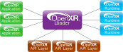
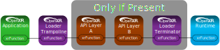

// Copyright (c) 2017-2025 The Khronos Group Inc.
//
// SPDX-License-Identifier: CC-BY-4.0

[[Overview]]
== Overview

OpenXR is a layered architecture, made up of the following elements:

* OpenXR Application
* <<openxr-loader, OpenXR Loader>>
* <<openxr-api-layers, OpenXR API Layers>>
* <<openxr-runtimes, OpenXR Runtimes>>

The general concepts in this document are applicable to the loaders
available for Windows and Linux based systems.

First, let's look at the OpenXR environment as a whole.
The OpenXR application is at the start of the execution chain, and
interfaces directly with the OpenXR loader.
The <<openxr-loader, loader>>, in turn, detects, loads, and interacts with
any number of OpenXR <<openxr-runtimes, runtimes>> and <<openxr-api-layers,
API layers>>.
Each OpenXR runtime controls a complete VR/XR/MR system that an application
can choose to interact with.
The loader may inject any number of optional API layers between the
application and the runtime to augment behavior.
As a result, any OpenXR command may involve executing code in a number of
different modules, including the loader, API layers, and runtimes.

=== Who Should Read This Document

While this document is primarily targeted at developers of
https://www.khronos.org/openxr[OpenXR] runtimes or API layers, and those
wishing to contribute to the OpenXR loader; the information contained in it
may be useful to anyone wanting a better understanding of OpenXR.

The link:{uri-openxr-ratified-spec}[OpenXR API Specification] should be used
as the primary means of understanding the OpenXR API and all care has been
made to not conflict with any element of that document.
In any case where this document and the
link:{uri-openxr-ratified-spec}[OpenXR API Specification] differ, behavior
as defined by the OpenXR specification must: be considered the correct
standard.

[[openxr-loader]]
=== OpenXR Loader

The loader is critical to detecting, exposing, and possibly loading any
available OpenXR runtime or API layer on the system.
Once setup, the loader is also responsible with managing the proper
dispatching of OpenXR commands to each of these components.

This document is intended to provide an overview of the necessary interfaces
between the loader and:

* <<application-interaction, OpenXR Applications>>
* <<api-layer-interaction, OpenXR API Layers>>
* <<runtime-interaction, OpenXR Runtimes>>

In addition, this document also covers various <<loader-design, internal
design>> elements of the OpenXR loader.

==== Goals of the Loader

The loader was designed with the following goals in mind.

1. It must: support one or more OpenXR-capable runtimes on a user's computer
system.
2. It must: support OpenXR API layers (optional modules that can be enabled
by an application, developer, or standard system settings).
3. It must: strive to reduce its overall memory and performance impact to an
OpenXR application.

[[openxr-api-layers]]
=== OpenXR API Layers

API layers are optional components that augment the OpenXR system.
They may intercept, evaluate, modify, and insert existing OpenXR commands on
their way from the application down to the runtime.
API layers are implemented as libraries that are enabled in a variety of
ways (including by application request).
All API layers are enabled in an OpenXR system during the `xrCreateInstance`
call.
Each API layer may choose to hook (intercept) any OpenXR command which in
turn may be ignored or augmented.
An API layer does not need to intercept all OpenXR commands but only
intercept those commands it desires.

Some examples of features that API layers may expose include:

* Validating API usage
* Adding the ability to perform API tracing and debugging
* Intercept and filter information between the application and the runtime

Because API layers are optional, you may choose to enable API layers for
debugging your application, but then disable any API layer usage when you
release your product.

For more information on how the OpenXR interacts with API layers, refer to
the <<api-layer-interaction, "API Layer Interaction">> section of this
document.

[[openxr-runtimes]]
=== OpenXR Runtimes

OpenXR works with multiple runtimes each supporting one or more devices.
Each OpenXR runtime controls a complete VR/AR/MR system.
Multiple runtimes may be installed on a system, with one being _active_ at
any given time.
The loader discovers the active runtime on the system and loads it.
When an `XrInstance` is created during `xrCreateInstance`, the active
runtime is associated with the instance.

For more information on how the OpenXR interacts with runtimes, refer to the
<<runtime-interaction, "Runtime Interaction">> section of this document.

[[openxr-objects]]
=== OpenXR Objects

OpenXR uses an object model to control the scope of a particular action or
operation.
The object to be acted on is usually the first parameter of an OpenXR call.
Under the covers, this object is a unique handle to either a class or
structure.
The contents of each class/structure vary, but each has a means of looking
up a dispatch table which is used to direct the functional flow through any
enabled API layers and into the appropriate runtime.

[NOTE]
.Note
====
Some OpenXR commands do not take an object, such as
`xrEnumerateApiLayerProperties` and
`xrEnumerateInstanceExtensionProperties`.
These commands typically only provide information for other commands which
do take an object.
====

[[openxr-call-chains]]
=== OpenXR Call Chains

When an (optional) API layer is loaded, the loader links together a _call
chain_ that includes each function selected by the layer.
At `xrCreateInstance` time the loader initializes all enabled API layers and
creates call chains for each OpenXR command, with each entry of the
resulting dispatch table pointing to the first element of that chain.
The loader builds an individual dispatch table for the `XrInstance` that is
created.

When an application calls an OpenXR command, this typically will first hit a
_trampoline_ function in the loader.
These _trampoline_ functions are small, simple functions that jump to the
appropriate dispatch table entry for the object they are given.
Some functions also require an additional loader function called a
_terminator_, which is called after all enabled API layers to process data
before proceeding to the appropriate runtime.

The loader only allows a single outstanding `XrInstance` and uses the
generated dispatch table for that `XrInstance` for all OpenXR API commands.
