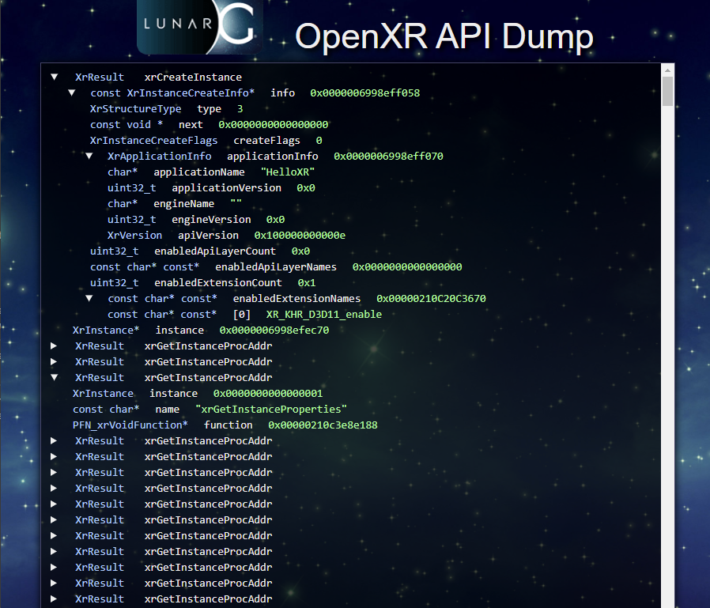

# The API Dump API Layer

<!--
Copyright (c) 2017-2025 The Khronos Group Inc.

SPDX-License-Identifier: CC-BY-4.0
-->

## Layer Name

`XR_APILAYER_LUNARG_api_dump`

## Description

The API Dump layer records information about all OpenXR commands that it
encounters.  It only saves input information to each command, not the
results returned by lower API layers or the runtime.  This information can
then be written out to the prompt or a file.

## Settings

There are three modes currently supported:

1. Output text to stdout
2. Output text to a file
3. Output HTML content to a file

The default mode of the API Dump layer is outputting information to
stdout.  To enable text output to a file, two environmental variables
must be set:

* `XR_API_DUMP_EXPORT_TYPE`
* `XR_API_DUMP_FILE_NAME`

`XR_API_DUMP_EXPORT_TYPE` is used to define the type of output from API
dump.  Currently, this can only be set to the following options:

* `text`  : This will generate standard text output
* `html`  : This will generate HTML formatted content.

`XR_API_DUMP_FILE_NAME` is used to define the file name that is written
to.  If not defined, the information goes to stdout.  If defined,
then the file will be written with the output of the API dump layer.

## Example Output

### Example Text Output

For outputting text to a file, you would do the following:

```sh
export XR_API_DUMP_EXPORT_TYPE=text
export XR_API_DUMP_FILE_NAME=my_api_dump.txt
```

On Android, the equivalent settings are:
```sh
adb shell setprop debug.api_dump_export_type 'text'
adb shell setprop debug.api_dump_file_name '/sdcard/xr_apidump.txt'
```

When the `XR_APILAYER_LUNARG_api_dump` API layer is enabled, the
output (whether to stdout or a file) should look like
the following:

```none
XrResult xrCreateInstance
    const XrInstanceCreateInfo* info = 0x000000b0a32ff5c8
    XrStructureType info->type = 3
    const void * info->next = 0x0000000000000000
    XrInstanceCreateFlags info->createFlags = 0
    XrApplicationInfo info->applicationInfo = 0x000000b0a32ff5e0
    char* info->applicationInfo->applicationName = HelloXR
    uint32_t info->applicationInfo->applicationVersion = 0x0
    char* info->applicationInfo->engineName
    uint32_t info->applicationInfo->engineVersion = 0x0
    XrVersion info->applicationInfo->apiVersion = 0x100000000000e
    uint32_t info->enabledApiLayerCount = 0x0
    const char* const* info->enabledApiLayerNames = 0x0000000000000000
    uint32_t info->enabledExtensionCount = 0x1
    const char* const* info->enabledExtensionNames = 0x000001F52F564890
    const char* const* info->enabledExtensionNames[0] = XR_KHR_D3D11_enable
    XrInstance* instance = 0x000000b0a32ff1e0
XrResult xrGetInstanceProcAddr
    XrInstance instance = 0x0000000000000001
    const char* name = xrCreateInstance
    PFN_xrVoidFunction* function = 0x000001f53138afc8
XrResult xrGetInstanceProcAddr
    XrInstance instance = 0x0000000000000001
    const char* name = xrDestroyInstance
    PFN_xrVoidFunction* function = 0x000001f53138afd0
XrResult xrGetInstanceProcAddr
    XrInstance instance = 0x0000000000000001
    const char* name = xrGetInstanceProperties
    PFN_xrVoidFunction* function = 0x000001f53138afd8
...
XrResult xrGetInstanceProperties
    XrInstance instance = 0000000000000001
    XrInstanceProperties* instanceProperties = 000000B0A32FFC30
XrResult xrGetSystem
    XrInstance instance = 0000000000000001
    const XrSystemGetInfo* getInfo = 0x000000b0a32ffcd8
    XrStructureType getInfo->type = XR_TYPE_SYSTEM_GET_INFO
    const void * getInfo->next = 0x0000000000000000
    XrFormFactor getInfo->formFactor = 1
    XrSystemId* systemId = 000001F52F5484B0
XrResult xrEnumerateViewConfigurations
    XrInstance instance = 0000000000000001
    XrSystemId systemId = 1
    uint32_t viewConfigurationTypeCapacityInput = 0x0
    uint32_t* viewConfigurationTypeCountOutput = 000000B0A32FFBE0
    XrViewConfigurationType* viewConfigurationTypes = 0000000000000000
```

You'll notice that the information contains:

* The parameter's type
* The parameter's name (expanded if it's inside a structure)
* The parameter's value

### Example HTML Output

For outputting HTML content to a file, you would do the following:

```sh
export XR_API_DUMP_EXPORT_TYPE=html
export XR_API_DUMP_FILE_NAME=my_api_dump.html
```
On Android, the equivalent settings are:
```sh
adb shell setprop debug.api_dump_export_type 'html'
adb shell setprop debug.api_dump_file_name '/sdcard/my_api_dump.txt'
```

When the `XR_APILAYER_LUNARG_api_dump` API layer is enabled, and the
user has enabled HTML output, the resulting HTML file contents
(when rendered through an internet browser) should look like the
following:


